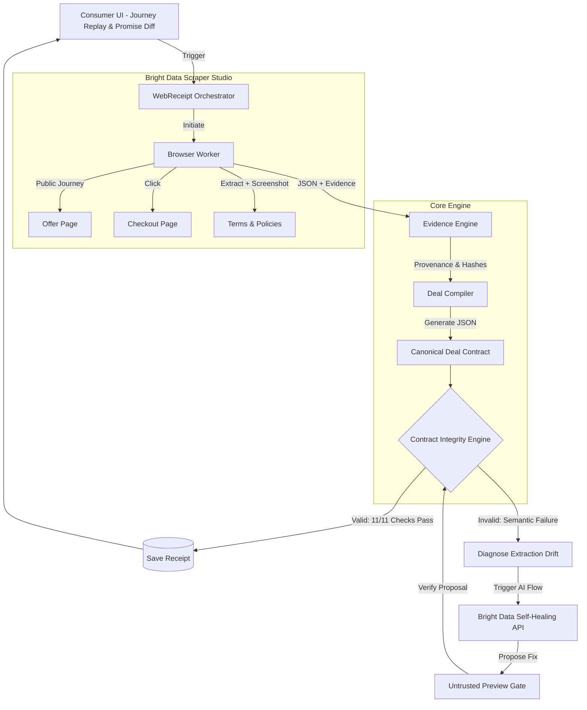

# WebReceipt — Proof of Promise

> **The internet has transaction receipts, but it has no receipts for promises.**

When you buy something online, the payment system remembers what you paid. It does **not** preserve what price attracted you, what mandatory fees appeared later, what refund terms were shown, or what exact evidence supported each claim.

Websites are mutable. Your evidence shouldn't be.

**WebReceipt turns an online purchase journey into a timestamped, verifiable Deal Contract—and keeps that evidence trustworthy even when the website redesigns itself using Bright Data Scraper Studio Self-Healing.**

---

## 🏗 Architecture

WebReceipt orchestrates anonymous browser journeys using Bright Data, compiles the extraction into a canonical Deal Contract, verifies the semantic integrity of the numbers, and autonomously heals the scraper if the website redesigns.



---

## 📜 The Canonical Deal Contract

Different websites look completely different, but WebReceipt compiles them into **one stable economic schema**.

Here is an example of the output structure:

```json
{
  "deal_id": "deal_7f29",
  "observed_at": "2026-08-17T14:10:22Z",
  "offer": {
    "advertised_price": 8499,
    "currency": "INR",
    "claim": "Free cancellation"
  },
  "checkout": {
    "base_price": 8499,
    "mandatory_fees": 848,
    "taxes": 800,
    "optional_addons": 0,
    "final_total": 10147
  },
  "terms": {
    "cancellation": "Free until 21 Aug",
    "refundability": "Refundable",
    "payment_timing": "Pay now"
  },
  "journey": {
    "steps": 4,
    "start_url": "https://example.com/search",
    "final_url": "https://example.com/checkout/7f29"
  },
  "evidence": [
    {
      "field": "final_total",
      "text": "Total ₹10,147",
      "timestamp": "2026-08-17T14:10:22Z",
      "screenshot": "checkout_004.png",
      "hash": "a83f...91d"
    }
  ]
}
```

---

## 🧠 Contract Integrity Engine

Normal scraper monitoring asks: `did field != null?`
WebReceipt asks: `does the reality still make sense?`

If a website redesigns and a CSS selector accidentally points to the *subtotal* instead of the *total*, the scraper will technically succeed, but the math will be wrong.

WebReceipt catches **semantic extraction drift**:

```text
CONTRACT INTEGRITY FAILED

base           8499
fees            848
tax             800
───────────────────
expected      10147
extracted      8499  <-- Silent failure detected!
```

---

## 🛠 Powered by Bright Data

WebReceipt's sponsor-backed path relies on Bright Data for the real browser journey and repair lifecycle:

1. **Scraper Studio (Browser Worker)**: navigates multi-step public booking flows, executes JavaScript, clicks through checkout panels, and captures DOM/screenshot evidence.
2. **AI Flow / Self-Healing API**: when the Contract Integrity Engine detects semantic failure, the real adapter can request a repair. WebReceipt treats the proposed preview as untrusted, validates it against the Deal Contract, and only approves/autosaves a repair after it passes.

The current Next.js product UI uses a deterministic simulator. The real Bright Data adapter and controlled public fixture are exposed by the sponsor harness in `src/server.js`, launched with `npm run start:brightdata` or by the Dockerfile. See `docs/BRIGHT_DATA_SETUP.md`.

---

## 🚀 Running Locally

Requires Node.js 20+.

```bash
# Install dependencies
npm install

# Run the Next.js product UI (deterministic simulator)
npm run dev

# http://localhost:3000
```

### Environment Variables

Copy `.env.example` to `.env` for the sponsor-backed live harness. Never commit real secrets.

```env
BRIGHT_DATA_API_TOKEN=your_token
BRIGHT_DATA_COLLECTOR_ID=c_prod_123
WEBRECEIPT_OPERATOR_TOKEN=use-a-strong-secret
```

### Verification

```bash
npm run verify
npm test
npm run verify:receipt -- examples/webreceipt.json
```

### Real Bright Data sponsor harness

For a real Scraper Studio create/run/heal proof, deploy or run the non-UI sponsor harness:

```bash
npm run start:brightdata
```

The Dockerfile launches the same `src/server.js` process. This path exposes `/fixture/hotel`, the controlled break/reset endpoints, and `BrightDataCollector`.

---

## 🎥 The 2-Minute Demo Flow

Open the **Console** at `/console` and walk the guided simulator steps. A broader resilience sweep lives at `/mutation-lab`, and the sealed contract history at `/receipts`.

1. **Observe Journey (0:00-0:30)**: run *Observe journey* to compile the Deal Contract (₹8,499 → ₹10,147) with evidence for every claim.
2. **Evidence Provenance (0:30-0:50)**: click a journey stage or contract field to open the evidence drawer — captured text, source URL, DOM path, timestamp and SHA-256 hash.
3. **Break It (0:50-1:10)**: run *Simulate redesign* to inject a *wrong-but-valid* total. The Contract Integrity Engine flips to invalid on `total_arithmetic`.
4. **Verified Heal Gate (1:10-1:30)**: run *Heal with Bright Data*. In the current Next UI this is a deterministic simulation of the same preview-verification protocol implemented by the real adapter.
5. **Promise Diff (1:30-2:00)**: run *Promise Diff* to view the synthetic commercial promise changes.

For sponsor judging, pair this UI walkthrough with the real terminal proof in `brightdata/CLI_RUNBOOK.md` using a genuine `c_*` Collector ID and token-masked evidence under `evidence/`.

---

## 📜 License

MIT
