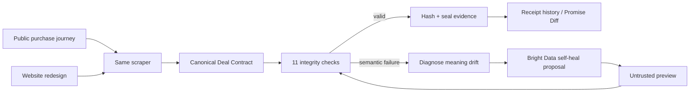

# WebReceipt

**Proof of promise, sealed in code.**

A payment receipt proves what you were charged. It usually does not preserve the price that pulled you in, the mandatory fees that appeared later, the refund terms you saw, or the evidence behind any of those claims.

WebReceipt does. It turns a public purchase journey into a timestamped **Deal Contract**, checks that the extracted economics still make sense, seals the evidence with SHA-256, and refuses to trust a scraper repair until the repaired output passes the same contract checks.

**Live app:** [web-receipt-tawny.vercel.app](https://web-receipt-tawny.vercel.app)  
**Fast judge path:** [Console](https://web-receipt-tawny.vercel.app/console) · [Mutation Lab](https://web-receipt-tawny.vercel.app/mutation-lab) · [Receipts](https://web-receipt-tawny.vercel.app/receipts) · [Docs](https://web-receipt-tawny.vercel.app/docs)

## Live UI

<p align="center">
  
</p>

<p align="center">
  
</p>

<p align="center">
  
</p>

<p align="center">
  
</p>

The browser walkthrough is deterministic so a judge can reproduce it without spending a Bright Data run. The important part is that it no longer manufactures the bad number. The controlled checkout HTML changes from Fixture V1 to Fixture V2 while the scraper keeps the same `.total-price` selector. On V1 that selector means the final payable amount; on V2 it means `Subtotal`. The wrong-but-valid ₹8,499 therefore comes from changed markup and unchanged scraper logic, not from WebReceipt overwriting a field.

The repository also contains the real Bright Data collector lifecycle and protected server-side adapter used for sponsor proof.

## The two-minute version

Start in the **Console**.

1. **Observe website V1** — the controlled checkout is scraped, and WebReceipt compiles the advertised price, checkout breakdown, terms, journey metadata and evidence into one Deal Contract. The final-total selector is `.total-price`, and the contract passes 11/11 checks.
2. **Open evidence** — inspect the captured text, source URL, DOM path, timestamp and SHA-256 hash behind the final total.
3. **Redesign the website** — the fixture switches to V2, but the scraper stays on the same selector. `.total-price` now points at `Subtotal ₹8,499` while the real payable total remains ₹10,147 elsewhere in the DOM.
4. **Watch the integrity failure** — the scraper technically succeeded, but `8499 + 848 + 800 != 8499`, so WebReceipt refuses to trust the record.
5. **Repair the scraper** — the proposed selector repair is treated as untrusted. Its preview must compile into the Deal Contract and pass 11/11 checks before approval; then a fresh run must pass again.
6. **Promise Diff** — compare sealed contracts and see exactly what a checkout promise changed into.

Then open **Mutation Lab** for broader resilience cases and **Receipts** for the sealed contract history.

## Why this problem is harder than a broken selector

The dangerous scraper failure is often not “no value found.” It is **wrong-but-valid extraction**.

A redesigned page can make a selector read a subtotal where it used to read a total. The scraper succeeds. The field is populated. The number looks plausible. The record is still wrong.

WebReceipt makes the contract prove itself:

```text
base price        8,499
mandatory fees      848
taxes               800
optional add-ons      0
discounts             0
-----------------------
expected total    10,147
```

If the unchanged scraper extracts `8,499` from the redesigned page, the pipeline does not quietly save it. The Contract Integrity Engine flags the semantic drift.

That same rule is reused as the gate for self-healing. A repair is not trusted because an AI or a scraper vendor says it looks fixed; the repaired preview has to satisfy the contract, and the deployed repair has to survive a fresh collector run.

## What gets sealed

Different commerce sites can have completely different DOMs. WebReceipt normalizes them into one economic schema:

```json
{
  "deal_id": "deal_7f29",
  "observed_at": "2026-08-17T14:10:22Z",
  "offer": {
    "advertised_price": 8499,
    "currency": "INR",
    "claim": "Free cancellation"
  },
  "checkout": {
    "base_price": 8499,
    "mandatory_fees": 848,
    "taxes": 800,
    "optional_addons": 0,
    "final_total": 10147
  },
  "terms": {
    "cancellation": "Free until 21 Aug",
    "refundability": "Refundable",
    "payment_timing": "Pay now"
  },
  "evidence": [
    {
      "field": "final_total",
      "text": "Total ₹10,147",
      "timestamp": "2026-08-17T14:10:22Z",
      "hash": "a83f...91d"
    }
  ]
}
```

The useful part is not the JSON by itself. Each claim stays attached to provenance, and the contract can be re-verified after storage or comparison.

## Bright Data: the real sponsor path

Bright Data is not a logo pasted onto the project. The sponsor-backed flow has a real production Scraper Studio collector and a recorded failure → heal → recovery lifecycle.

**Collector:** `c_mt3ha1iv1jgm8eg813`  
**Name:** `webreceipt-proof-of-promise`  
**Controlled target:** `https://web-receipt-tawny.vercel.app/fixture/hotel`

The recorded sequence is:

```text
public target
→ Bright Data Scraper Studio Browser Worker
→ production c_* collector
→ structured dataset
→ controlled website / interaction drift
→ real extraction failure
→ Bright Data self-heal proposal
→ preview_result
→ WebReceipt arithmetic + field-preservation gate
→ human approval / auto-save
→ same collector ID rerun
→ recovered Deal Contract
```

The important detail is the **same Collector ID** survives the repair cycle. WebReceipt does not swap in a hand-edited happy-path result.

The current browser console and the sponsor track are deliberately honest about their boundary: the console deterministically reproduces the **semantic failure mechanism** from real fixture markup; the Bright Data track proves the real cloud collector/self-heal lifecycle with preserved evidence. Neither track injects a fake final total into an already-correct Deal Contract.

### Evidence you can inspect

| Step | Repository evidence |
| --- | --- |
| Collector creation | [`evidence/01-create.json`](evidence/01-create.json) |
| Healthy production run | [`evidence/02-run-v1.json`](evidence/02-run-v1.json) |
| Run after first change | [`evidence/03-run-after-change.json`](evidence/03-run-after-change.json) |
| Genuine failing run | [`evidence/04-run-v3-before-heal.json`](evidence/04-run-v3-before-heal.json) |
| Heal proposal / preview | [`evidence/05-heal-proposal.json`](evidence/05-heal-proposal.json) |
| Approved repair | [`evidence/06-heal-approved.json`](evidence/06-heal-approved.json) |
| Same-ID post-heal run | [`evidence/07-run-after-heal.json`](evidence/07-run-after-heal.json) |
| Lifecycle metadata | [`evidence/MANIFEST.md`](evidence/MANIFEST.md) |

The full sponsor reproduction steps live in [`brightdata/CLI_RUNBOOK.md`](brightdata/CLI_RUNBOOK.md).

## Architecture



There are two deliberately separate runtime modes:

- **Product UI:** deterministic controlled-fixture browser model. Fixture V1/V2 are real generated HTML states; the same scraper selector is run against both, so the bad value comes from the website redesign rather than an injected observation.
- **Sponsor / production adapter:** Bright Data-backed collection and healing through protected server-side routes and the CLI harness.

That separation keeps tokens and paid/mutating operations out of the browser while still preserving a real production integration.

## Protected Bright Data routes

A deployed instance can expose:

```text
GET  /api/brightdata/health
POST /api/brightdata/observe
POST /api/brightdata/heal
```

Live operations are protected by `WEBRECEIPT_OPERATOR_TOKEN` unless an explicit unprotected-live opt-out is configured. Secrets are never expected in the repository.

Do not assume a deployment has sponsor credentials just because the UI is live. Check `/api/brightdata/health` first.

## Run it locally

Node.js 20 or 22 is the tested range.

```bash
npm ci
npm run dev
```

Open `http://localhost:3000`.

For the full verification gate:

```bash
npm run verify
npm run stress:dev
npm run build
npm run smoke:next
npm run stress:next
```

The GitHub workflow runs that gate on both Node 20 and Node 22, including the domain tests, scraper-studio validation, chaos/stress coverage, a production Next build, API smoke tests and localhost stress tests.

To verify a sealed example receipt directly:

```bash
npm run verify:receipt -- examples/webreceipt.json
```

## Environment for the sponsor-backed path

Copy `.env.example` to `.env` and provide the required values locally or through your deployment platform.

```env
BRIGHT_DATA_API_TOKEN=your_token
BRIGHT_DATA_COLLECTOR_ID=c_prod_123
BRIGHT_DATA_TARGET_URL=https://public.example.com/your-target
WEBRECEIPT_OPERATOR_TOKEN=use-a-strong-secret
```

Never commit real tokens.

## Repository map for judges

| Where | What is there |
| --- | --- |
| [`app/console`](app/console) | Observe V1 → website redesign → semantic failure → verified repair → diff |
| [`app/mutation-lab`](app/mutation-lab) | Broader scraper mutation / resilience scenarios |
| [`app/receipts`](app/receipts) | Sealed receipt history |
| [`src/domain`](src/domain) | Deal Contract, hashing, integrity rules, diffing |
| [`src/integrations/controlled-fixture.js`](src/integrations/controlled-fixture.js) | Deterministic HTML scrape showing the same selector change meaning across V1/V2 |
| [`src/integrations`](src/integrations) | Controlled fixture, public-web and Bright Data integration code |
| [`brightdata`](brightdata) | Scraper Studio package, parser, schemas and CLI runbook |
| [`evidence`](evidence) | Committed sponsor lifecycle evidence |
| [`test`](test) | Domain, integration, hardening, fuzz and regression tests |
| [`docs/HACKATHON_SUBMISSION.md`](docs/HACKATHON_SUBMISSION.md) | Rubric mapping and truthfulness boundary |
| [`docs/JUDGE_QA.md`](docs/JUDGE_QA.md) | Short answers to likely judge questions |

## One claim I want a judge to remember

**When a website redesign makes a scraper keep returning a valid number with the wrong meaning, WebReceipt catches the semantic contradiction and makes the repair prove itself before anything is trusted.**

MIT licensed.
