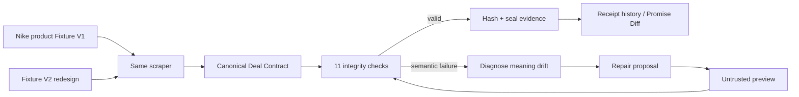

# WebReceipt

**Proof of promise, sealed in code.**

A payment receipt proves what you were charged. It usually does not preserve the price that pulled you in, the mandatory charges that appeared later, the terms you saw, or the evidence behind any of those claims.

WebReceipt turns a public purchase journey into a timestamped **Deal Contract**, checks that the extracted economics still make sense, seals the evidence with SHA-256, and refuses to trust a scraper repair until the repaired output passes the same contract checks.

**Live app:** [web-receipt-tawny.vercel.app](https://web-receipt-tawny.vercel.app)  
**Fast judge path:** [Console](https://web-receipt-tawny.vercel.app/console) · [Nike product fixture](https://web-receipt-tawny.vercel.app/fixture/product?version=v1) · [Mutation Lab](https://web-receipt-tawny.vercel.app/mutation-lab) · [Receipts](https://web-receipt-tawny.vercel.app/receipts)

## The judge story: Nike/product semantic drift

The main demo is a WebReceipt-controlled **Nike Pegasus 41** product journey. It exists to demonstrate the dangerous scraper failure that is harder than a missing selector: **the scraper succeeds, returns a clean number, and assigns it the wrong business meaning after a page redesign**.

Fixture V1 is internally consistent:

```text
Nike Pegasus 41 product price    ₹12,999
shipping                            ₹500
other mandatory fees                 ₹0
taxes                                ₹0
----------------------------------------
final total                       ₹13,499
```

The V1 scraper reads the final payable amount from `.total-price`, so `checkout.finalTotal = 13,499` and the Deal Contract passes its integrity checks.

Then the website changes to Fixture V2 while the scraper stays unchanged:

- `.total-price` still exists and still contains a valid currency value.
- But the redesigned page now uses `.total-price` for **Product price ₹12,999**.
- The true **Final total ₹13,499** moves to `[data-testid="order-total"]`.
- The unchanged scraper therefore returns `₹12,999` as `checkout.finalTotal` without throwing an extraction error.

WebReceipt rejects that result because the economics contradict it:

```text
12,999 + 500 + 0 + 0 != 12,999
```

That is the core semantic-drift story: the selector did not disappear. **Its meaning changed.**

## Two-minute judge path

Start in the **Console**.

1. **Observe Nike V1** — scrape the controlled Pegasus 41 product journey. Product price is ₹12,999, shipping is ₹500, and final total is ₹13,499.
2. **Open evidence** — inspect captured text, source URL, DOM path, timestamp and SHA-256 provenance behind the values.
3. **Redesign the product page** — switch to Fixture V2 while keeping the same V1 scraper selector.
4. **Watch the wrong-but-valid failure** — `.total-price` still returns ₹12,999, but that value now means product price rather than final total. The Contract Integrity Engine rejects the contradiction.
5. **Repair the scraper** — the proposed repair points final-total extraction at the new semantic container. The preview must compile into the same Deal Contract and pass the integrity gate before approval.
6. **Rerun after approval** — trust is restored only after a fresh scrape passes again.
7. **Promise Diff** — compare sealed contracts to see exactly what changed over time.

The wrong number comes from the changed HTML plus the unchanged scraper. WebReceipt does not inject or overwrite a fake final total after extraction.

## Why this matters

Most scraper monitoring can detect obvious breakage such as an empty selector. The more dangerous case is a selector that still matches something plausible.

A product redesign can turn:

```text
.total-price  → Final total ₹13,499
```

into:

```text
.total-price  → Product price ₹12,999
```

A conventional scraper reports success both times. WebReceipt makes the extracted contract prove itself before the value is sealed or a repair is trusted.

## What gets sealed

Different commerce sites can have completely different DOMs. WebReceipt normalizes them into one economic schema with provenance attached to the critical claims.

```json
{
  "subject": "Nike Pegasus 41 · Men's Road-Running Shoes",
  "offer": {
    "advertisedPrice": 12999,
    "currency": "INR"
  },
  "checkout": {
    "basePrice": 12999,
    "mandatoryFees": 500,
    "taxes": 0,
    "optionalAddons": 0,
    "discounts": 0,
    "finalTotal": 13499
  },
  "evidence": [
    {
      "field": "checkout.finalTotal",
      "capturedText": "₹13,499",
      "domPath": ".total-price",
      "observedAt": "2026-08-23T00:00:00.000Z",
      "hash": "…"
    }
  ]
}
```

Each claim stays attached to its source evidence, and the whole Deal Contract is sealed so later mutation is detectable.

## Bright Data sponsor proof — preserved hotel history

The judge-facing product story is now Nike/product semantic drift. The existing Bright Data hotel evidence is intentionally preserved unchanged as **sponsor-proof history** rather than rewritten to pretend those older cloud runs were Nike runs.

The preserved real Bright Data collector identity is:

**Collector ID:** `c_mt3ha1iv1jgm8eg813`  
**Name:** `webreceipt-proof-of-promise`  
**Historical controlled target:** `https://web-receipt-tawny.vercel.app/fixture/hotel`

That ID is recorded in the original collector-creation artifact and throughout the historical lifecycle evidence. The checked-in `brightdata/parser.js` now supports both the legacy hotel fixture and the Nike-style product fixture; the historical evidence remains immutable sponsor proof for the earlier hotel failure → heal → same-ID recovery cycle.

The recorded sponsor sequence is:

```text
hotel V1 healthy run
→ same real Bright Data Collector ID
→ controlled site changes
→ genuine extraction failure
→ Bright Data self-heal proposal
→ preview_result
→ WebReceipt arithmetic + field-preservation gate
→ approval / auto-save
→ same Collector ID rerun
→ recovered Deal Contract
```

### Preserved sponsor evidence

| Step | Repository evidence |
| --- | --- |
| Collector creation / real ID | [`evidence/01-create.json`](evidence/01-create.json) |
| Healthy production run | [`evidence/02-run-v1.json`](evidence/02-run-v1.json) |
| Resilient run after change | [`evidence/03-run-after-change.json`](evidence/03-run-after-change.json) |
| Genuine failing run | [`evidence/04-run-v3-before-heal.json`](evidence/04-run-v3-before-heal.json) |
| Heal proposal / preview | [`evidence/05-heal-proposal.json`](evidence/05-heal-proposal.json) |
| Approved repair | [`evidence/06-heal-approved.json`](evidence/06-heal-approved.json) |
| Same-ID post-heal run | [`evidence/07-run-after-heal.json`](evidence/07-run-after-heal.json) |
| Lifecycle metadata | [`evidence/MANIFEST.md`](evidence/MANIFEST.md) |

The sponsor reproduction steps live in [`brightdata/CLI_RUNBOOK.md`](brightdata/CLI_RUNBOOK.md).

### Cloud completion rule

A checked-in parser change is not enough to claim a Bright Data production update. The Scraper Studio collector must be saved/published with the final parser and **the exact same real Collector ID `c_mt3ha1iv1jgm8eg813` must be rerun successfully**. A replacement `c_*` ID does not satisfy that gate.

## Architecture



There are two deliberately separate proof tracks:

- **Judge/product UI:** deterministic Nike Pegasus 41 controlled fixture. The actual HTML changes between V1 and V2 while the scraper keeps the same selector, so the bad value comes from semantic drift in the page.
- **Sponsor history / production integration:** preserved Bright Data Scraper Studio lifecycle evidence using the real collector ID, protected server-side adapter, and CLI harness.

This keeps paid/mutating sponsor operations out of the browser UI without faking the sponsor history.

## Protected Bright Data routes

A deployment configured with sponsor credentials can expose:

```text
GET  /api/brightdata/health
POST /api/brightdata/observe
POST /api/brightdata/heal
```

Live operations are protected by `WEBRECEIPT_OPERATOR_TOKEN` unless an explicit unprotected-live opt-out is configured. Secrets are never expected in the repository.

Do not assume a deployment has working sponsor credentials merely because the UI is live. The cloud collector state and same-ID rerun are separate verification gates.

## Run locally

Node.js 20 or 22 is the tested range.

```bash
npm ci
npm run dev
```

Open `http://localhost:3000` and use `/console` for the product semantic-drift loop or `/fixture/product?version=v1` to inspect the controlled product HTML directly.

Full local verification:

```bash
npm run verify
npm run stress:dev
npm run build
npm run smoke:next
npm run stress:next
```

The GitHub workflow runs the verification gate on Node 20 and Node 22, including scraper-studio validation, domain tests, chaos/stress coverage, production Next build, API smoke tests and localhost stress tests.

## Sponsor-backed environment

```env
BRIGHT_DATA_API_TOKEN=your_token
BRIGHT_DATA_COLLECTOR_ID=c_mt3ha1iv1jgm8eg813
BRIGHT_DATA_TARGET_URL=https://your-public-target.example
WEBRECEIPT_OPERATOR_TOKEN=use-a-strong-secret
```

Never commit real tokens.

## Repository map for judges

| Where | What is there |
| --- | --- |
| [`app/console`](app/console) | Nike V1 → product redesign → wrong-but-valid failure → verified repair → diff |
| [`app/fixture/product`](app/fixture/product) | Public controlled Nike-style product fixture |
| [`src/product-fixture-page.js`](src/product-fixture-page.js) | Product V1/V2 markup that changes `.total-price` semantics |
| [`src/integrations/product-controlled-fixture.js`](src/integrations/product-controlled-fixture.js) | Same-scraper product semantic-drift extraction |
| [`brightdata/parser.js`](brightdata/parser.js) | Scraper Studio parser supporting controlled hotel/product fixtures plus generic public commerce pages |
| [`app/mutation-lab`](app/mutation-lab) | Broader scraper mutation / resilience scenarios |
| [`app/receipts`](app/receipts) | Sealed Deal Contract history |
| [`src/domain`](src/domain) | Deal Contract, hashing, integrity rules and diffing |
| [`evidence`](evidence) | Preserved historical Bright Data sponsor lifecycle evidence |
| [`test/product-semantic-drift.test.js`](test/product-semantic-drift.test.js) | Literal Nike/product wrong-meaning regression test |
| [`docs/HACKATHON_SUBMISSION.md`](docs/HACKATHON_SUBMISSION.md) | Rubric mapping and truthfulness boundary |
| [`docs/JUDGE_QA.md`](docs/JUDGE_QA.md) | Short answers to likely judge questions |

## One claim to remember

**When a website redesign makes a scraper keep returning a valid number with the wrong meaning, WebReceipt catches the semantic contradiction and makes the repair prove itself before anything is trusted.**

MIT licensed.
